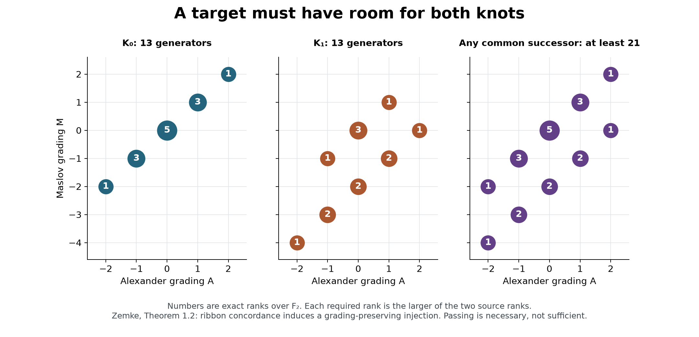
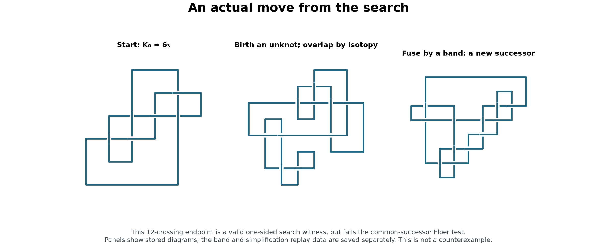

# Counterexample campaign: audit, calculations, and next attack

**No counterexample has been found.** This session excluded one explicit candidate, exposed an ineffective old obstruction search, and implemented a more selective constructive search. This report supersedes conflicting claims in the earlier campaign notes.

The exact target is a knot in S³ that bounds a smooth disk in the **standard B⁴** and bounds **no ribbon disk**. A failed search, a rational slice disk, a disk in an unspecified homotopy ball, or a non-ribbon particular disk does not satisfy that target.

## What changed

| Claim | Evidence from this session | Confidence and remaining check |
|---|---|---|
| The explicit Hom–Park knot below is not slice | Advanced and direct HKL both return (2,3); independent cable rebuild; four exact non-norm witnesses | Strong computational obstruction, with an independent rational-arithmetic check of the final algebra. Topological representation construction still uses SnapPy. |
| The old basic HKL runs on D₀₁ and D₀₂ skipped every relevant module factor | Exact finite-field multiplicity audit and inspection of the installed implementation | Verified for the recorded grid only. New advanced/direct tests are meaningful but currently unobstructed. |
| The stored K₀ and K₁ meet the non-ribbon theorem's hypotheses | Exact Alexander and HFK calculations; certified disjoint hyperbolic volume intervals | Does not depend on trusting the annulus-twist name of the second PD. Sliceness of their difference remains open. |
| The original K₀ successor search could not reach a common successor | All 3,413 distinct endpoint diagrams fail Zemke's necessary graded-rank test | Exact rejection of these endpoints, not of unsearched concordances. |
| Longer paths reach new targets | First 16 of 6,073, then 60 of 12,832 endpoint diagrams pass the same filter | The wider run includes 48 non-fibered diagrams, in 30 numerical types. No common successor identified; passing a necessary test is not a concordance certificate. |
| K_G has a usable small algebraic model | Exact integral reduction of its stored 28×28 matrix to 10×10, with two saturated isotropic rank-five lattices | Algebraic model only. No embedded fiber or finite classification of ribbon disks. |

## The constructive route worth pursuing

Prioritize the difference D = K₀ # (−K₁), with the actual PDs in the two Abe–Tagami input cards. Here − denotes the concordance inverse. Both input knots are fibered of genus two, with irreducible Alexander polynomial

Δ(t) = t⁴ − 3t³ + 5t² − 3t + 1.

Their verified hyperbolic volumes lie near 5.69302109128130 and 9.12000650079812, in disjoint intervals. Thus they are distinct. Abe–Tagami Corollary 4.3 supplies non-ribbonness of D. These checks are saved in `results/AT_nonribbon_hypotheses_verified.json`; the corresponding script recomputes them. [Tetsuya Abe and Keiji Tagami, *Fibered knots with the same 0-surgery and the slice-ribbon conjecture*, arXiv:1502.01102v5, Corollary 4.3](https://arxiv.org/html/1502.01102v5).

**The missing object is a smooth concordance between K₀ and K₁.** Search for a common ribbon successor J:

```text
K₀ ── births, isotopies, fusing saddles ──▶ J
K₁ ── births, isotopies, fusing saddles ──▶ J
```

Reverse the second annulus and compose to obtain a smooth concordance. Its maxima are permitted. This makes D smoothly slice and, together with the theorem, would complete a counterexample. A hit must include both movies, an orientation check, and a verified identification of the endpoints preserving the appropriate peripheral data.

There is an existential reason to search common successors. Using Teichner's lemma, if D is slice, some ribbon R makes D # R ribbon. Set H = K₀ # R # K₁ # (−K₁). Adding the ribbon summand R # K₁ # (−K₁) gives K₀ ≤ H. Reorder H as K₁ # (D # R) to get K₁ ≤ H. Conversely, a common successor gives concordance. This derivation concerns unrestricted movies; none of our finite boxes is complete. The lemma is stated by [Peter Teichner in his 14 March 2010 MathOverflow answer](https://mathoverflow.net/questions/7052/what-would-the-slice-ribbon-conjecture-imply/18154).

The alternative constructive implementation remains D # R: certify both R and D # R ribbon. The certificate script now verifies both objects and never labels an unverified endpoint as a slice certificate. A blanket ban on fibered partners was withdrawn: applying Miyazaki's theorem requires checking its hypotheses on every prime summand.

**The old reversed search was the wrong direction for this pair.** It searches common predecessors A ≤ K₀ and A ≤ K₁. Each input has no proper ribbon predecessor: a predecessor of a fibered knot is fibered; a ribbon concordance gives a compression of fibers; for genera g and g′ the induced H₁ kernel has dimension g−g′ and is invariant under monodromy. Irreducibility of the degree-2g monodromy polynomial forces this kernel to be zero, hence g′=g. A ribbon concordance between fibered knots of equal genus forces isotopy. Thus A would have to equal both distinct inputs, a contradiction. This is a deduction using the checked input polynomial, fiberedness, and the cited compression/same-genus results, not a search-failure inference. The historical script is now labelled as a predecessor search and cannot call numerical hits slice certificates. [Zemke, §1.5](https://arxiv.org/html/1902.04050), [Casson–Gordon's compression criterion as stated in Agol–Ren, Theorem 1.7](https://arxiv.org/html/2603.10884v1).

## A filter that changes where we search

Write hᵢ(A,M) for the F₂ rank of the input's hat knot Floer homology. A common ribbon successor must satisfy

hⱼ(A,M) ≥ max(h₀(A,M), h₁(A,M)) for every pair (A,M).

The sum of these maxima is **21**, although each source has total rank 13. Required groups occur on both M−A = 0 and M−A = −2. Therefore a Floer-thin target is impossible. This is a necessary-condition deduction from [Ian Zemke, *Knot Floer homology obstructs ribbon concordance*, Annals of Mathematics 190 (2019), 931–947, Theorem 1.2, DOI 10.4007/annals.2019.190.3.5](https://arxiv.org/html/1902.04050).



`scripts/fusion_successors.py` adds a split unknot, overlaps its projection by an explicit reverse Reidemeister II move, then attaches an oriented fusing band. The old splitting-band routine searched in the opposite direction. Two early prototypes produced only cancelling birth/saddle pairs; their logs are retained as failed pilots. The corrected implementation stores the birth isotopy, band, raw endpoint, and simplified endpoint. Exact replay uses the same Spherogram library, so it is a consistency check rather than an independent topological verifier.

| Search | Moves | Distinct diagram signatures | HFK computed | Pass the common-successor rank test |
|---|---:|---:|---:|---:|
| K₀, shortest paths, length ≤6, twists ≤2 | 32,272 | 3,413 | 3,413 | 0 |
| K₁, same bounds, move-capped | 50,000 | 3,397 | 3,397 | 1,670 |
| K₀, sampled detours, length ≤9, twists ≤3 | 24,000 | 6,073 | 6,073 | 16 |
| K₀, wider detours, length ≤10, twists ≤5 | 32,000 | 12,832 | 12,832 | 60 |

All 25,715 HFK calculations above also passed the source-to-endpoint injection check. Every recorded movie replay passed. The detour run used seed 20260912, 16 random path attempts per endpoint/face choice, and at most 3,000 moves per old face. The wider run used seed 20260913, 24 attempts, and at most 4,000 moves per face; it produced 60 compatible diagrams, including 48 non-fibered ones in 30 numerical types. Across the four runs, 138,272 moves were generated. The first K₁ run has prefix bias from its move cap. Distinct diagrams are not necessarily distinct knots. Counts between runs can overlap.

The 16 survivors of the first detour run are all fibered of genus four and HFK rank 149. Numerical peripheral isometry signatures group them into five types. No exact diagram match or successful numerical peripheral match with the K₁ library was found. Failed/nonhyperbolic identifications remain unresolved. The 16 full witnesses are in `results/fusion_AT0_HFK_survivors.json`. The wider run’s 60 witnesses, with non-fibered cases first, are in `results/fusion_AT0_wider_targets.json`. All 60 had successful numerical signatures, but none matched the successfully identified K₁ library entries; 185 K₁ diagrams lacked a successful hyperbolic identification. The smallest retained non-fibered diagrams have 23 crossings, genus three, and HFK rank 117.

**A further theoretical reason to prioritize non-fibered targets:** for a fibered input with irreducible rational monodromy polynomial, a proper compression to a connected lower-genus fiber would give a nonzero proper invariant kernel in H₁. Its rank is g−g′, contradicting irreducibility. This proves minimality among the fibered predecessors represented by such compressions. Agol–Ren state, after Question 1.15, that distinct minimal hyperbolic knots of genus at most three cannot have a common fibered upper bound. The statement is an unnumbered claim in a preprint; we have not independently reconstructed its characteristic-submanifold argument. **Use this as a priority rule, not a certified discard rule.** [Ian Agol and Qiuyu Ren, *Ribbon concordance of fibered knots and compressions of surface homeomorphisms*, arXiv:2603.10884v1 (2026)](https://arxiv.org/html/2603.10884v1).



A first backward probe was also executed on three distinct numerical non-fibered targets: 5,000 splitting bands per target, length at most six and twists at most two. Each run found 16 detectable split-unknot deaths, reducing to one predecessor diagram, with no K₁ Floer match. The 15,000-band probe is a bounded negative, recorded in `results/target_predecessor_probe.json`; it does not exhaust predecessors of those targets.

## An explicit candidate removed

The particular knot tested is

P = T(2,3)₂,₁ # −T(2,3)₂,₃ # T(2,5)₂,₃ # −T(2,5)₂,₁.

Its old basic HKL results were not a reliable reason to retain it. Both `method='advanced'` and `method='direct'`, with `ribbon_mode=False`, now return **(2,3)**. The direct run eliminates all four candidate metabolizers of H₁(Σ₂(P)) ≅ Z/3 ⊕ Z/3.

An independent input construction uses the four explicit four-strand braids [2,1,3,2]ⁿ followed by σ₁^(q−2n), for (n,q) = (3,1),(3,3),(5,3),(5,1), with summand signs +,−,+,−. Every cable passes the Alexander satellite identity, and its τ value is respectively 2,3,5,4. The rebuilt 88-crossing sum reproduces both obstructions.

All four relevant twisted polynomials are saved over Q[z]/(z²+z+1). In order, they have root z of multiplicity 1, root −z of multiplicity 3, root −z of multiplicity 3, and root z of multiplicity 1. These roots are fixed by conjugate-reciprocal involution. Any norm g(t) conjugate(g(t⁻¹)) has even multiplicity there, so none of the four polynomials is a norm. `scripts/verify_hp_norms.py` verifies those multiplicities using only Python rational arithmetic; it does not call SnapPy, Sage, or a factorizer.

This is a computational nonsliceness result for **this member**, with reproducible exact algebra. It does not close the whole Hom–Park family and carries no claim of literature priority. The family's published non-ribbon result is [Jennifer Hom and JungHwan Park, *Ribbon knots and iterated cables of fibered knots*, Mathematische Zeitschrift 313, article 53 (18 June 2026), Corollary 1.3, DOI 10.1007/s00209-026-04050-3](https://link.springer.com/article/10.1007/s00209-026-04050-3).

For D₀₁ and D₀₂, every relevant irreducible representation in the old basic grid has multiplicity two. Basic HKL explicitly skips those factors. New advanced calculations on D₀₁ at (2,13), (3,7), and (5,2), and a direct calculation at (2,13), return no obstruction. These are meaningful negative results with limited scope. The basic/advanced/direct distinction follows [Nathan M. Dunfield and Sherry Gong, *Ribbon concordances and slice obstructions: experiments and examples*, arXiv:2512.21825 (2025), §3](https://arxiv.org/abs/2512.21825) and the inspected SnapPy 3.3.2 implementation.

## Repairs to the theory record

**Unlink exteriors.** For n>1, the n-component unlink exterior has n torus boundary components. A handlebody has connected boundary. The two-component unlink is already a counterexample to the old claim. Do not use `isHandlebody` as an unlink test. The valid starting point is the existence of an unlink derivative on some Seifert surface. The handle-ribbon characterization via an R-link derivative has a homotopy-ball ambient category that must be tracked. [Maggie Miller and Alexander Zupan, *Equivalent characterizations of handle-ribbon knots*, arXiv:2005.11243, Proposition 1.1 and Theorem 1.3](https://arxiv.org/html/2005.11243).

**Normal generation is not generation.** In F₂ = ⟨x,y⟩, the pair x and w=yxyx⁻¹y⁻¹ normally generates: killing x makes w=y. But under x↦(12), y↦(23) in S₃, both x and w map to (12). Their images generate order two while the original generators generate S₃. Thus the pair cannot generate F₂. This refutes the old proof's inference; it is not a counterexample to Slice–Ribbon.

**Repair of the nilpotent argument.** Let G be an R-link group, α:Fₙ→G its meridian map, and β:G→Fₙ the surgery quotient. The zero linking matrix makes β an H₁-isomorphism. On each finitely generated nilpotent quotient, α is surjective because the meridians generate abelianization. The induced endomorphism (βα)ₖ of the free nilpotent group is an automorphism: it is surjective on abelianization, hence surjective, and finitely generated nilpotent groups are Hopfian. Therefore αₖ is injective as well as surjective, and βₖ is an isomorphism. Since β kills each longitude, each longitude lies in every lower-central subgroup. This recovers the Milnor-vanishing conclusion without claiming the surgery meridians form a free basis. It does not prove the strengthened boundary-link assertion suggested by the external review.

**Abstract versus embedded disks.** Disk slides in an abstract handlebody do not show that corresponding curves on an embedded Seifert surface stay an unlink in S³. The slide band may meet proposed spanning disks. That preservation claim remains unproved here. The statements that there can be no intermediate obstruction, that every construction necessarily lands in one category, and that no existing tool could ever finish a counterexample are withdrawn as unsupported universal claims.

**The K_G matrix.** The stored matrix is singular 28×28, not a 10×10 fiber matrix. Nine exact integral S-reductions produce an invertible 10×10 matrix of determinant −1. Smith normal form gives saturated rank-five kernels for the two irreducible factors of the algebraic monodromy polynomial; both restrict the Seifert form to zero. Determinant identities were checked independently at t=−1,1,2,3. This supplies algebraic data, not embedded curves. Restricting to two homology lattices cannot dispose of infinitely many geometric representatives or stabilized surfaces. Standard-B⁴ sliceness of K_G is source-backed by [Trevor Oliveira-Smith, *A Dunfield–Gong 4-Sphere is Standard*, arXiv:2603.23717v1 (2026), Corollary 1.1.1](https://arxiv.org/html/2603.23717v1); its handle proof was not independently verified in this session.

## The next experiment, and the stop rules

1. Search for **non-fibered, Floer-thick common successors**, allowing longer detours and two births. Retain parents that fail the common-target test: their descendants may pass it. Use the graded filter on endpoints and compare with the K₁ library; spend HFK work once per candidate, caching results.
2. Search backwards from promising targets using splitting bands to reach K₁. A hit must retain both complete movies and pass independent orientation, endpoint, and peripheral checks. Numerical signatures only nominate hits.
3. First refine D₀₁’s surviving (2,13) characters using the actual linking form: the direct test reduced 14 subgroup candidates to four but did not impose isotropy in that routine. Carry the characters and linking pairing in the same verified basis. Then extend advanced/direct HKL to selected D₀₂ and higher-cover cases where the applicability audit predicts actual tests. Any nonzero sliceness obstruction closes that specific difference. Stop treating `None` as evidence of sliceness.
4. Keep K_G as a separate geometric project: recover an embedded fiber and the paper's actual disk data before any derivative enumeration. Require a theorem controlling the stabilization quantifier before turning finite failures into non-ribbonness.

The session used Astra for integration, one bounded Opus critique, and local deterministic calculations for the large searches. Opus's outputs were audited, not accepted as proof. Codex and Work share an allowance; moving the same work into Work does not supply extra quota. The budget was interpreted as a cap of 13 additional percentage points from the initial 2% meter reading, with a buffer before 15%. The last recorded meter was 9% used, an observed increase of seven percentage points, within the 13-point cap. This is a rounded shared-account meter. No usage reset or recurring task was created. [OpenAI, Work/Codex usage documentation, checked 12 September 2026](https://learn.chatgpt.com/docs/pricing).

All source checks above were made on 12 September 2026. Software versions, raw-search compression hashes, command recipes, and validation logs are retained. These are reproducible research computations, not a formally verified proof. The highest-value next result is an actual common-successor movie, or a new exact obstruction that eliminates a remaining difference; merely increasing a search counter is not progress toward either certificate.
