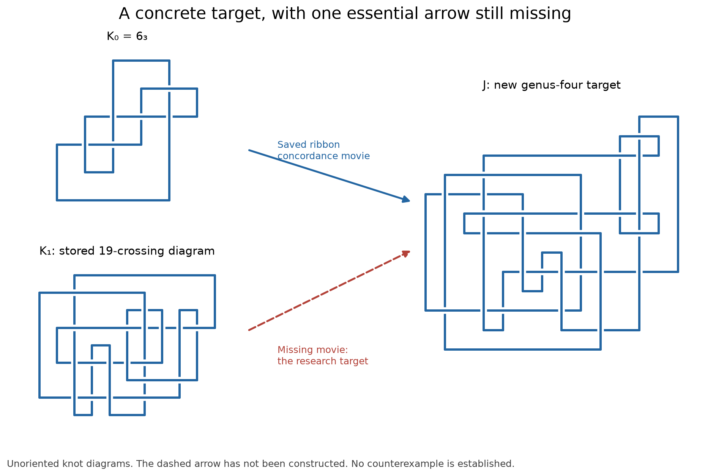

# Resumed Slice–Ribbon investigation — 12 September 2026

**No counterexample found.** The most concrete candidate remains
D01=K0#(-K1), using the stored Abe–Tagami pair. Its nonribbonness was checked
against the applicable theorem in the earlier audit. The missing result is
an explicit smooth concordance between K0 and K1, equivalently a smooth slice
disk for D01 in standard B4. None of this session's algebraic or bounded
search results supplies that disk.

This report supersedes the pending-work entries in `FOLLOWUP_2026-09-12.md`.
All development remains on `main`.

## What we learned

| Claim | Evidence | Confidence / limitation | Next falsification or construction |
|---|---|---|---|
| A broader movie search reaches a genuinely nonsplit intermediate | Exact Jones inequality, checked by two algorithms | Exact polynomial calculation on the stored PD; move conventions are software dependencies | Replay in an independent topology engine before promoting any endpoint meeting |
| A small new geometric target exists on the K0 side | Saved two-birth/two-saddle movie for 26-crossing, fibered genus-four J149 | Computationally replayed; only one of the two required arrows exists | Find K1→J149, allowing linked intermediates |
| Ordinary and involutive knot-Floer local-equivalence invariants cannot distinguish this pair | 256 full-ring basis changes; exhaustive 4,096-case involutive audit; independent implementation | Conditional on the calculator's quotient complex, absolute gradings and full-ring lifting argument | Use additional geometric or branched-cover information |
| The specific double-cover HKL refinement is ineffective | Explicit Fox-to-Goeritz character basis, two isotropic lines, exact norm certificates | Opposite checkerboards agree; determinant routine remains a SnapPy dependency | Move beyond (2,13), rather than rerun the same test |
| Old torsion estimates could be wrong in either direction | Synthetic countermatrices and exact Smith calculation checked by binary ranks | Exact algebra on the input complexes | Use actual torsion orders in future fusion bounds |
| No common successor was identified in the enlarged finite search | 32,768 replayed attempts; 2,436 completed HFK checks; combined indices 267 versus 1,962 records | 82 HFK timeouts; samples and band families incomplete | Targeted two-fission reverse search and longer band paths |

## Four detailed notes

1. [Sharper low-genus target restrictions](research/10_low_genus_targets.md).
   A genus-two common successor needs HFK rank at least 29 and cannot be
   fibered. A fibered common successor needs genus at least four.
2. [Exhaustive involutive local-equivalence audit](research/11_involutive_local_equivalence.md).
   The stored complexes reduce locally to the figure-eight involutive class.
   This is an algebraic conclusion, not a concordance construction.
3. [Coupled movies, exact nonsplitting and corrected torsion](research/12_coupled_movie_audit.md).
   Includes search counts, failures, candidate details, Khovanov outcomes and
   an explanation of why the intermediate Alexander test could not work.
4. [Fox–Goeritz/HKL basis audit](research/13_fox_goeritz_hkl.md).
   Both actual metabolizers survive the double-cover norm test. Their
   polynomials are explicit squares, with directly checked norm factors.



## Invariants and unsuccessful checks

K0 and K1 retain zero values in the completed graded-s, odd-BLS and sl3 s
calculations. K1's even Sq2 refinement is also zero. The relevant D01 jobs
and odd Sq2 jobs that exceeded their limits are recorded as timeouts, never
as zeros. Exact new torsion orders are K0=1, K1=1, J149=1, KG=1, KB=1 and
GST=2. The old largest-entry shortcut had incorrectly suggested J149=2 and
KB=5; GST's largest entry was six. A finite lower bound on fusion number
cannot prove a knot is globally nonribbon.

Advanced HKL tests for (cover degree, character prime) (4,3), (4,13), (8,3)
and (8,13) all finish without an obstruction. Direct tests at (4,3) and (8,3) also finish without an obstruction, as recorded
in `results/resumed_hkl_higher_direct/manifest.json`.

Failed initial replay assertions caused by simplified-diagram relabeling,
failed Jones implementations, unsuccessful Alexander/hyperbolicity tests,
and timeout logs are retained. Later successful versions are identified by
their result files; their existence does not erase an earlier failure.

Opus supplied two adversarial reviews, costing $0.601911 and $0.7611675 in
the retained CLI reports. Several suggestions were mathematically wrong and
were rejected explicitly. The reviews and corrections are in
`results/opus_resumed_reviews.json`; they are not primary mathematical evidence.

## Reproduction and provenance

Use the established knot environment described in
`REPRODUCE_2026-09-12.md`. This session used Python 3.14.6, SnapPy 3.3.2,
Spherogram 2.4.1, the knot_floer_homology package 1.2.2, Regina 7.4.1 distribution (runtime reports
7.4), and passagemath-standard 10.8.11. KnotJob manifests record the exact JAR
hash and Java version. Inputs and computed results are committed; runtime
binaries are not.

Run from the repository root with `P=../knot-venv/bin/python`. Use new output
paths: the scripts refuse to overwrite prior results. For example:

```sh
mkdir -p ../resumed-recheck
$P scripts/verify_involutive_structure.py results/involutive_structure_audit.json ../resumed-recheck/involutive.json
$P scripts/validate_torsion_order.py ../resumed-recheck/torsion.json --extended
$P scripts/two_fission_target.py results/coupled_small_targets.json ../resumed-recheck/two-fission.json --seconds 180
$P scripts/hkl_fox_goeritz.py data/knots/AbeTagami_D_0_1.json ../resumed-recheck/hkl.json --compute all
$P scripts/verify_fox_goeritz.py ../resumed-recheck/characters.json results/fox_goeritz_D01_all.json results/fox_goeritz_square_control.json results/fox_goeritz_6_3_control.json
```

Each compressed movie archive begins with its input PD, random seed, path
length, twist range, placements, sample sizes and time cap; its last record
contains the actual totals and stopping reason. `audit_coupled_births.py`
replays an archive and runs its selected HFK checks. The four main runs use:

| Side / family | Placements × first × second | Path length | Seed | Audit sample / seed / timeout |
|---|---|---:|---:|---|
| K0 batch1 | 40 × 12 × 32 | 8 | 20260917 | 128 / 20260919 / 3 s |
| K1 batch1 | 40 × 12 × 32 | 8 | 20260918 | 128 / 20260920 / 3 s |
| K0 double return | 8 × 16 × 8 | 14 | 20260922 | 64 / 20260923 / 2 s |
| K1 double return | 8 × 16 × 8 | 14 | 20260924 | 64 / 20260925 / 2 s |

All use twist bound three and generation time cap 180 seconds; double-return
runs add `--face-return --return-loops 2`. Runtime limits and library
simplification can affect regenerated samples and labels. The saved raw
archives, rather than bit-for-bit regeneration, are the primary replay inputs.
`results/resumed_session_manifest.json` records the session's file hashes and
aggregate integrity checks.

## Best next attempt

Work directly on J149. The new bounded reverse two-fission search generates
2,207 first and 311,098 second candidates, recovers K0 as a positive control,
and finds no K1 endpoint. Its intermediate-link Alexander-rank filter rejects
impossible cases efficiently. Extend this run beyond its 180-second, path and
per-intermediate limits, or search the K1 side with returning and longer band
paths. See note12 for exact counts and limitations. Keep intermediate vertices even when they fail the final
common-successor HFK bound. A positive meeting requires independently checked
oriented peripheral identification and complete annulus movies on both sides.

The known-slice KG/GST route remains separate and would require a global
nonribbon obstruction. Do not revive the explicit Hom–Park input: its
nonsliceness was established in the preceding audit. Do not interpret any
unresolved candidate or exhausted finite search as a counterexample or proof
of the conjecture.
