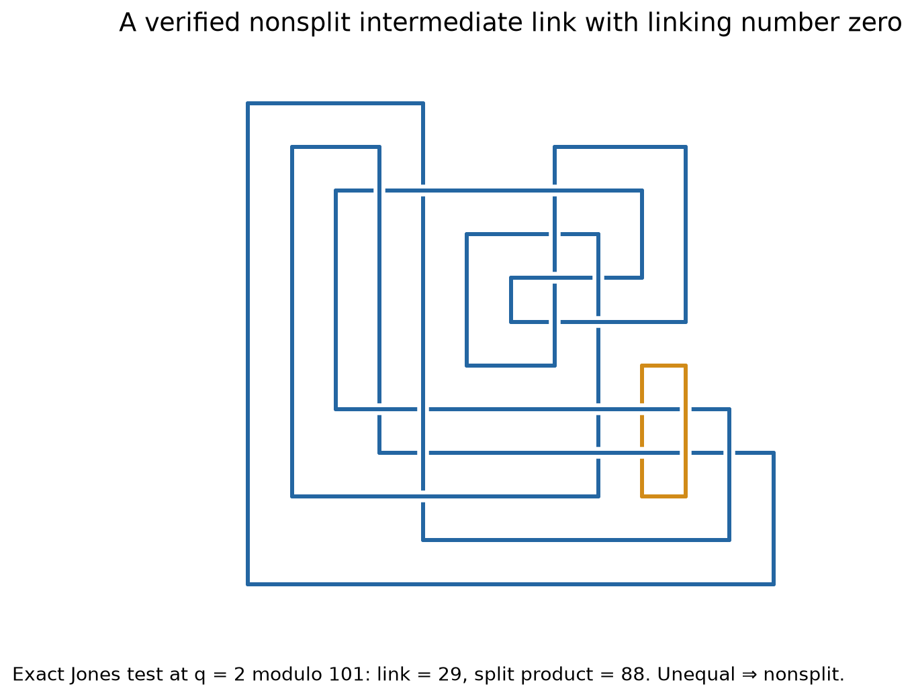

# Coupled births, a nonsplit intermediate, and the genus-four target

12 September 2026. **No counterexample found.** The exact question is whether
the stored K0=6_3 and Abe–Tagami K1 are smoothly concordant in S3×I. The audited
Abe–Tagami theorem makes their difference D01 nonribbon; a concordance would
supply its missing smooth disk in standard B4. A common ribbon successor J
would be one way to give that concordance. J itself need not be ribbon.

## What changed geometrically

The earlier two-birth search inserted one unknot, fused it, and then repeated.
The new generator inserts both split unknots before either saddle. Both saddles
join different components. With two births and two saddles, the connected
oriented cobordism has Euler characteristic zero and two boundary components,
so is an annulus, subject to the move library's orientation conventions.

This permits a linked two-component intermediate. Initially, the generator's
simple paths in the planar dual graph could not return to a face. We added
short return loops with opposing over/under choices, and longer base paths.
Repeated original arcs and nonplanar band chords are still rejected: this is
an incomplete family. The parameter requesting two return loops does not mean
every sampled band contains two; actual return positions are recorded.

A comment by Ian Agol on 6 January 2025 explains why bands may need to pass
through other born circles: [primary MathOverflow discussion](https://mathoverflow.net/questions/485317/reidemeister-moves-for-concordant-knots).
This motivates the added presentations. It does not prove that their endpoint
knots lie outside the old search's unrestricted endpoint set.

## A positive, exact search-capability check

In `coupled_K0_double_return.jsonl.gz`, placement 1, first saddle 20, the
intermediate link has 19 crossings and linking number zero. One component is
an unknot. Its Jones polynomial differs from the product required of a split
union. In the recorded q convention, at q=2 modulo 101:

`J(intermediate) = 29`, while `(q+q^-1) J(component 1) J(component 2) = 88`.

Regina's treewidth and naive algorithms agree on the full polynomial, and the
q convention was calibrated against Spherogram using a split-link control and
a Hopf-link control. This proves this **intermediate link is nonsplit**. It is
not a proof that an endpoint has no different sequential-birth presentation.
See `coupled_nonsplit_two_algorithm_check.json` and the linked raw Jones record.

An unsuccessful diagnostic is also preserved. Several intermediate-link
Alexander polynomials vanish and interval hyperbolicity verification failed.
Vanishing generic Alexander polynomial is expected here: the first-stage link
is concordant to K⊔unknot, whose generic Alexander nullity is one. Nagel and
Powell's nullity invariance at transcendental unit-circle parameters explains
why this particular test cannot establish nonsplitting for these movies.
A nonzero generic Alexander polynomial would instead flag a movie inconsistency.
Source: Matthias Nagel and Mark Powell, *Concordance invariance of Levine–Tristram
signatures of links*, Documenta Mathematica 22 (2017), 25–43,
[arXiv:1608.02037v2](https://arxiv.org/html/1608.02037v2), Theorem 1.2.

## Bounded search and replay

The four main archives contain 32,768 saddle-pair attempts, all replayed.
Small pilots add 1,024 attempts, for 33,792 generated in this session.
The replay independently reconstructs births and both raw band moves, but
shares the underlying move library. Basic Reidemeister simplification can
relabel crossings nondeterministically; raw diagrams agree exactly and the
simplified diagrams agree by canonical diagram signature. This is a
computational audit, not a formally verified topology engine.

| Archive | Attempts | Unique diagrams | HFK checked | Computed | Unknown | Pass both rank bounds |
|---|---:|---:|---:|---:|---:|---:|
| K0 batch1 | 15,360 | 5,412 | 1,299 | 1,299 | 0 | 2 |
| K1 batch1 | 15,360 | 4,203 | 719 | 663 | 56 | 194 |
| K0 double return | 1,024 | 631 | 363 | 353 | 10 | 6 |
| K1 double return | 1,024 | 394 | 137 | 121 | 16 | 26 |
| Total | 32,768 | 10,640 within runs | 2,518 | 2,436 | 82 | 228 |

No computed endpoint failed the rank injection from its own source, a useful
negative control. HFK selection was prioritized and sampled, not exhaustive.
Timeouts remain unknown and were retained when comparing endpoint indices.
The combined comparison has 267 K0-side and 1,962 K1-side records, with zero
canonical-diagram, numerical-peripheral, or connected-sum-factor matches.
These are record counts, not a census of distinct knots. Numerical signatures
would only nominate a match requiring oriented peripheral verification.

The earlier 12 left and 185 right numerical failures were separately examined:
all had visible connected-sum decompositions, and factor keys supplied no new
matches. None was silently treated as a nonmatch merely because a numerical
routine failed. Another bounded run produced 121 alternate diagrams of K1,
all still at least 19 crossings; no smaller diagram was found.

## The most concrete new target

K0 batch1 move 10187 (first saddle 319) gives a 26-crossing target J149:
computed fibered genus four, total HFK rank 149, determinant 117 and tau zero.
Both K0 and K1 inject into its bigraded HFK. Both also pass the stored quotient
chain-map and homotopy-retraction filters. **Only the K0→J149 geometric movie
is known. The K1→J149 movie remains missing.**

A bounded reverse search tested 7,130 single fission bands, found 11 visible
split-unknot deaths and one distinct predecessor diagram, and found no K1 HFK
match. This exhausted that run's shortest-dual-path enumeration with length
at most ten and twist range two; it did not exhaust all bands or two-saddle
reverse movies. See `coupled_small_predecessors.json`.

The bounds in [the low-genus note](10_low_genus_targets.md) sharpen the target:
a common successor of genus two needs rank at least 29 and must be nonfibered;
a fibered common successor has genus at least four. J149 attains the latter
minimum genus, but not the minimum allowable rank. Its geometric existence
on only one side supplies no evidence strong enough to call it a common target.

## Targeted reverse two-saddle search

A subsequent 180-second run enumerated 2,207 first-band candidates and 311,098
second-band candidates (counts include candidates generated at the stopping
boundaries). It rejected 1,585 first candidates by nonzero linking number and
388 distinct intermediate diagrams by full Alexander rank at t=2 over F101.
Nonzero evaluated rank proves the generic Alexander polynomial is nonzero;
a lower rank only retains the candidate. The filter is calibrated on knots,
a Hopf link, a split knot–unknot pair, and the proven nonsplit intermediate.

The run retained 157 intermediates, with no rank-computation failures. It
found 241 visible two-unknot deaths but only one distinct remaining endpoint:
K0, matching both its HFK and numerical peripheral signature. The saved
positive control uses first band `0b06_0_0` and second band `1918_0_-1`.
No K1 endpoint was found. This recovers a known source, not necessarily the
inverse of the original saved two-birth movie. Most intermediate searches
reached the 2,000-second-band cap; two finished their finite enumeration and
one reached the overall time cap. Hence this is a bounded negative result.
See `two_fission_J149.json`, `two_fission_alexander_controls.json`, and
`scripts/two_fission_target.py`. Paths were shortest in the planar dual graph,
length at most eight, with twist bound two.

## Corrected torsion orders

An actual implementation error was found in `scripts/torsion_order.py`.
The largest U exponent of a differential entry is not the torsion order.
For example, the homogeneous matrices

`[[U,U²],[U²,0]]` and `[[U,U²],[0,U]]`

have Smith exponents (1,3) and (1,1), respectively. The entry shortcut gives
two in both cases and can err in either direction. The replacement uses exact
homogeneous monomial Smith elimination and verifies d²=0. An independent
binary-rank calculation modulo U^N agrees with every recorded elementary
divisor, with localized homology rank one in all knot examples.

| Knot | Largest entry exponent | Actual torsion order |
|---|---:|---:|
| K0 | 1 | 1 |
| K1 | 1 | 1 |
| J149 | 2 | 1 |
| KG = 18nh00000601 | 1 | 1 |
| KB 0-friend | 5 | 1 |
| GST knot | 6 | 2 |

Thus the GST knot requires at least two bands if ribbon by the applicable
Floer fusion bound. This is a lower bound on ribbon presentations, not global
nonribbonness. The 6_1 and 8_19 controls and both synthetic countermatrices are
included in `torsion_order_extended_check.json`.

## Isolated Khovanov calculations

Each job now has its own process, timeout, output and checkpoint record.
Graded-s and the chosen odd-BLS invariant finish with zeros on K0, K1 and D01;
trefoil and ribbon controls give the expected values. K1's even Sq2 refinement
finishes at (0,0,0,0). Its two odd Sq2 jobs and all three D01 Sq2 jobs time out
at 300 seconds. The sl3 s values in characteristics 0, 2 and 3 finish at zero
for K0 and K1; the corresponding D01 jobs time out at 120 seconds. No timeout
is assigned a value, and no unproved additivity of refinements is used.

## Limits and next construction

The strongest next geometric attempt is to extend the two-fission reverse
search from J149 beyond its path and per-intermediate caps, or a targeted K1 successor search
using the longer/returning band paths that produced the proven nonsplit
example. A positive numerical meeting must be upgraded to oriented knot
identification and replayable annuli. The finite negative searches above
remain inconclusive about concordance and about Slice–Ribbon.
