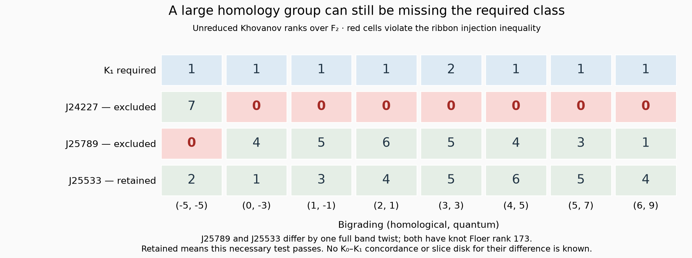

# Nonfibered upper knots: a missing graded obstruction

13 September 2026. **No counterexample found.**

The question remains whether the stored Abe–Tagami knots K0 and K1 are
smoothly concordant in S3 × I. The existing input audit supplies nonribbonness
of D = K0 # -K1; a standard smooth concordance would supply its missing slice
disk in B4. A common ribbon upper knot J, with K0 → J ← K1, would suffice:
reverse the second annulus and concatenate in the product. Neither algebraic
retractions nor unsuccessful band searches produce that annulus.

## The pool was much less viable than its Floer checks suggested

The earlier file `results/fusion_AT0_wider_targets.json` contains **60 targets:
48 nonfibered and 12 fibered**, not 60 nonfibered targets as initially stated
in this session. All 48 nonfibered targets have genus three. The genus-four
rank-117 targets are fibered. Their saved raw forward movies replay.

The old reverse pilot tested only three targets and capped each at 5,000
shortest-path bands. This was a coverage gap, but a more important missing
filter was full bigraded Khovanov homology.

**Established theorem.** Adam Simon Levine and Ian Zemke, *Khovanov homology
and ribbon concordances*, Bulletin of the London Mathematical Society 51
(2019), 1099–1103, DOI [10.1112/blms.12303](https://doi.org/10.1112/blms.12303),
[arXiv:1903.01546v2](https://arxiv.org/html/1903.01546v2), Theorem 1:
a ribbon concordance gives a split injection preserving both gradings.
The result applies over any coefficient ring. Therefore, over a field,

    dim Kh^(i,j)(K1) ≤ dim Kh^(i,j)(J)

is necessary in every bigrading. Total rank alone is insufficient. The
theorem and grading statement were read directly on 13 September 2026.

**New computation.** Unreduced even Khovanov homology over F2 excludes **46
of the 48 nonfibered K0-based targets**. Only **25533 and 25541** survive.
All 48 satisfy the known K0 injection inequality. Every computed Euler
characteristic agrees with a separately computed Regina Jones polynomial.
These checks support the calculation; they do not independently reconstruct
the entire Khovanov complex.

For example, K1 has dimension one in bigrading (0,-3), while J24227 has
dimension zero. J24227 cannot be a ribbon upper knot for K1, despite its
total F2 Khovanov rank 426 and its passing Floer filters. This excludes
**every ribbon concordance K1 → J24227**, not just the tested bands. It
does not exclude an ordinary smooth concordance between them.

Both surviving targets also pass the graded inequalities over Q and F3.

| Knot | F2 total Kh rank | Q total Kh rank | F3 total Kh rank |
|---|---:|---:|---:|
| K0 | 26 | 14 | 14 |
| K1 | 90 | 30 | 30 |
| J25533 | 474 | 206 | 206 |
| J25541 | 474 | 206 | 206 |



The comparison contains a useful geometric detail. J25533 and J25789 have
the same recorded band core and crossing choices, with twist parameters -1
and +1. Thus they differ by one full band twist. Both have total HFK rank
173. Nevertheless, J25789 fails precisely at Kh bigrading (-5,-5), while
J25533 passes the full F2 test. The analogous pair is 25541/25797. This is
a measured distinction, not a conjectured concordance or a general theorem
about the sign of twisting.

## Search direction and completed experiments

The computed F2 Kh ranks of K0 are bounded by those of K1 in every
bigrading. Hence a genuine ribbon upper knot built from K1 automatically
passes this particular rank test for K0 as well, by transitivity of the
inequalities. This says nothing about a geometric map K0 → K1.

The pre-existing K1 threaded archive has 1,670 Floer-envelope survivors,
including 1,111 nonfibered targets. Its five smallest nonfibered diagrams
have 25 crossings: indices 23841, 29229, 32887, 34723 and 41600. We searched
these toward K0, rather than continuing to search the 46 excluded targets.

| Experiment | Recorded scope | Outcome |
|---|---|---|
| Broad K0-based pilot | 755,164 checkpointed bands; 36 targets reached | No K1 nomination; interrupted once Kh exclusions were known |
| Focus on 25533 and 25541 | 119,242 bands; 400 extra global simplifications | K0 controls recovered; no K1 HFK match |
| Five smallest K1-based targets | 128,369 bands; 500 extra global simplifications | K1 diagram controls recovered in all five; no K0 HFK match |
| Two reverse saddles on 25533 | 2,500 first bands; 61 retained intermediates; up to 500 second bands each | Only known K0 endpoint; no K1 match |

The two-saddle script's historical counters include the item triggering a
cap: its saved values are 2,501 and 30,233, whereas 30,173 second bands were
processed. These are bounded visits, not exhaustive classifications.

The new one-saddle sampler explicitly chooses dual edges, including choices
between parallel edges. It samples face-simple paths of different lengths
with recorded seeds. This extends shortest-only coverage but remains biased
and incomplete. Failure of simplification to detect a split unknot is left
inconclusive. Every retained raw reverse band can be replayed. A future hit
still needs independent endpoint identification and an audited isotopy movie.

KnotJob's printed extortion orders on K0, K1, 25533 and 25541 are all one in
characteristics 0, 2 and 3. This supplies no distinction. The original Lee
statement in Sucharit Sarkar, *Ribbon distance and Khovanov homology*,
Algebraic & Geometric Topology 20 (2020), 1041–1058,
[Theorem 1.1](https://arxiv.org/html/1903.11095), compares the images after
multiplication by (2X)^d; its useful field version requires characteristic
different from two. Equal printed orders do not certify equality of the
full deformed complexes.

A further sl3 pilot is **inconclusive**: both surviving target calculations
timed out after 60 seconds each. The trefoil, K0 and K1 calculations finish;
their rational ranks are 7, 27 and 139. Their Euler characteristics agree
with Regina's HOMFLY specialization after accounting for KnotJob's sl3
quantum convention, alpha=q^-3. No missing output is treated as a zero rank.
Sungkyung Kang, *Link homology theories and ribbon concordances*,
[arXiv:1909.06969v4](https://arxiv.org/html/1909.06969v4), 10 December 2019,
Corollary 2, supplies injectivity for Khovanov–Rozansky theories. We read the
theorem's field-valued setting; no sl3 obstruction is claimed in this pilot.

## Validation and limits

The stronger simplification pilot exposed an omitted Wirtinger generator:
Spherogram's `_pieces()` starts at undercrossings, so a component that
passes entirely over the other components is absent. The Alexander-rank
helper now includes that component. A real search input reproduces the old
missing entry and passes the repaired calculation. One hand-built test
fixture failed independent PD planarity reconstruction; it is preserved as
a rejected fixture and replaced with a valid unlink. Neither failure is
silently converted into an obstruction.

`scripts/check_nonfibered_session.py` rechecks the saved homology logs and
Jones equalities, the graded inequalities, raw forward and reverse band
operations, and the missing-generator regression. Read its generated ledger
for exact counts. No endpoint nomination became a slice certificate.

The newer finiteness result does not eliminate this direction. John A.
Baldwin, Jonathan Hanselman and Steven Sivek, *Ribbon concordance and fibered
predecessors, II: the general case*, [arXiv:2602.21109v1](https://arxiv.org/html/2602.21109v1),
24 February 2026, Theorem 1.2, gives finitely many fibered predecessors of a
fixed knot. It does not assert uniqueness. Section 1.3 describes a possible
algorithmic consequence, not an implemented predecessor enumerator. Read
13 September 2026; the proof is not independently reconstructed here.

**Next experiment:** retain the two Kh-compatible K0 targets and prioritize
the nonfibered K1-built frontier. For two-stage movies, distinguish failures
to produce the desired component knots from failures to separate them. Save
links whose component invariants match K0 or K1 plus unknots, even when they
remain linked, and then target their geometry. Increase path diversity and
change diagrams before raising the same shortest-first caps. Any proposed
construction must still give an annulus in the standard product.

## Reproduction

Use the existing topology Python environment. KnotJob requires the existing
Java runtime and author-distributed jar; no setup changes were made.

```text
python scripts/khovanov_upper_filter.py JAVA KNOTJOB_JAR results/fusion_AT0_wider_targets.json NEW_OUTPUT_DIRECTORY
python scripts/nonfibered_reverse_audit.py results/nonfibered_kh_survivors.json NEW_OUTPUT_JSON --count 2 --length 10 --global-checks 200 --shortest-moves 15000 --sample-moves 50000 --sample-attempts 250000 --seconds 90 --seed 20260914
python scripts/nonfibered_reverse_audit.py results/K1_nonfibered_shortlist.json NEW_OUTPUT_JSON --count 5 --forward-source K1 --length 8 --global-checks 100 --shortest-moves 20000 --sample-moves 20000 --sample-attempts 140000 --seconds 50 --seed 20260915
python scripts/check_nonfibered_session.py
```

Fresh searches refuse existing output names. Time caps can change how many
samples finish; saved seeds, inputs and bands preserve the retained witnesses.
